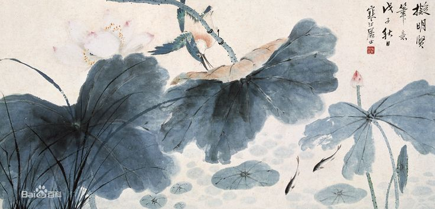
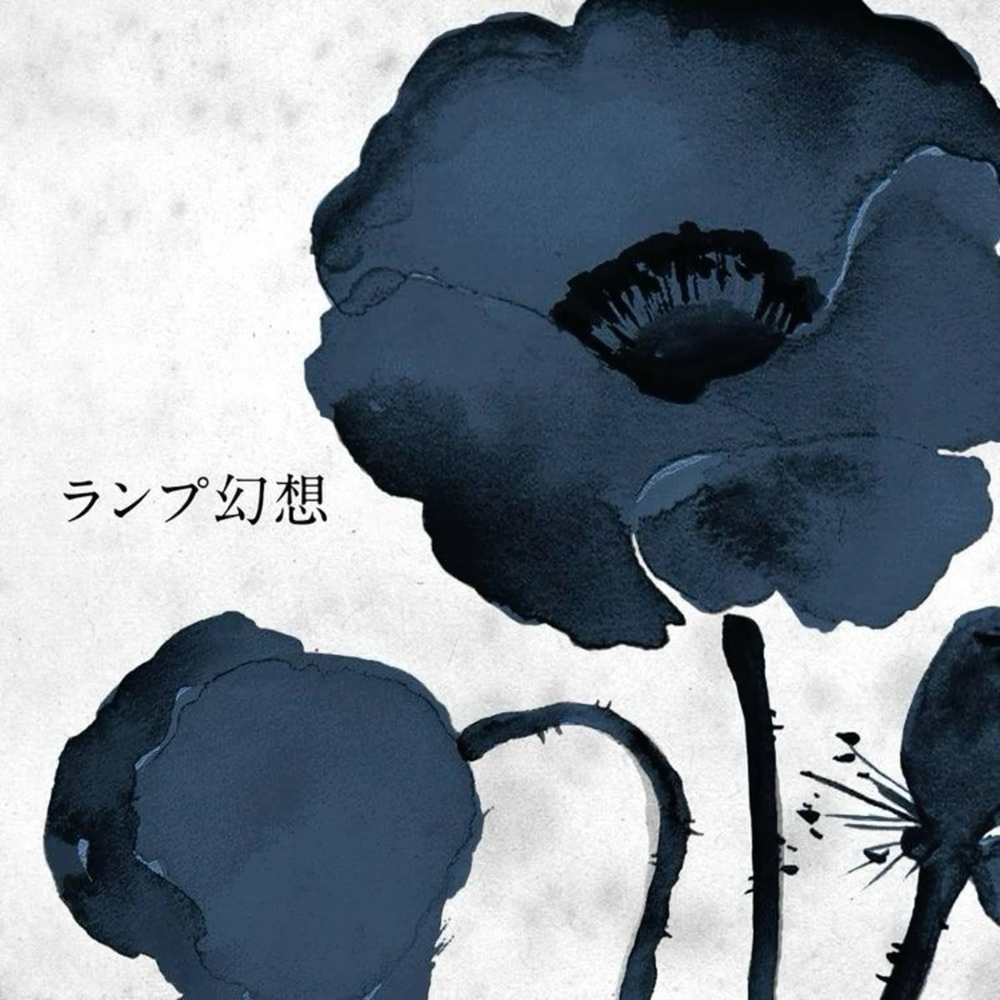
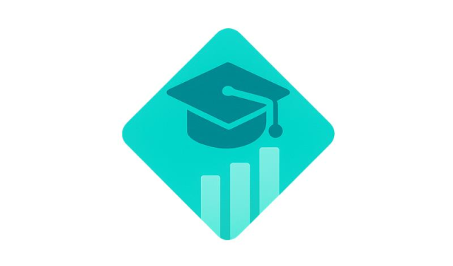

  

<h1 align="center" style="background: linear-gradient(90deg, #ff8a00, #e52e71); -webkit-background-clip: text; color: transparent;">
  Olá, eu sou Luis 👋
</h1>

Desenvolvedor Full-Stack | Apaixonado por tecnologia e aprendizado contínuo

  

---

## 🌱 Sobre mim
- 💻 Linguagens favoritas: Python, JavaScript, TypeScript  
- 🎯 Objetivo: Criar aplicações web modernas e soluções em ML  
- 🌱 Atualmente aprendendo: React, Machine Learning, DevOps  
- 📫 Contato: luisotavioss20001@gmail.com  

  

  🌹 <b>Rosa Azul:</b> Para mim, a rosa azul representa o impossível que nos inspira a continuar. Ela simboliza a perseverança, a busca constante por realizar sonhos e a coragem de nunca desistir, mesmo diante de desafios que parecem inatingíveis.

---

## 🛠 Tecnologias e Ferramentas

  
  
  
  
  
  
  
  
  

---

## 🚀 Projetos Recentes

  <a href="https://github.com/LuisSarache/InovaClass-frontEnd" title="InovaClass: Aplicação Web com React e Node.js">
    
    
<b>InovaClass</b> Aplicação Web com React e Node.js

  </a>

---

## 📊 Estatísticas do GitHub

  
  

---

## 📈 Minhas Atividades Recentes

  

---

## 🏆 Conquistas

  
  
  
  

---

## 📫 Contato

  

---

  Feito com ❤️ por <b>Luis</b>

